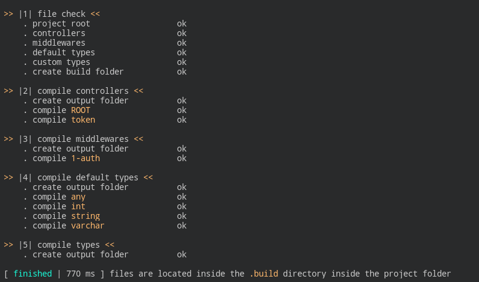

# | aicra |

[](https://golang.org/doc/go1.10)
[](https://opensource.org/licenses/MIT)
[](https://goreportcard.com/report/git.xdrm.io/go/aicra)
[](https://godoc.org/git.xdrm.io/go/aicra)


**Aicra** is a self-working framework coded in *Go* that allows anyone to create a fully featured REST API. It features type checking, authentication management through middlewares, file upload, rich argument parsing (*i.e. url slash-separated, urlencoded, form-data, json*), nested routes, project compiler (*i.e. aicra*), etc.

All the REST API management is done for you, you just need to implement :

- the controllers
- the middlewares (to manage authentication, csrf, etc)
- the type checkers to check if input arguments follows some rules

There is 2 drivers that lets you implement these features in Go or whatever language.


This framework is based over some of the following concepts.

| concept | explanation |
|---|---|
| meaningful defaults | Defaults and default values work without further understanding |
| configuration  driven | Avoid information duplication. Automate anything that can be automated without losing control. Have *one* configuration that summarizes the whole project, its behavior and its automation flow. |


> A working example is available [here](https://git.xdrm.io/example/aicra)


#### Table of contents
<!-- toc -->

- [I. Installation](#i-installation)
  * [1. Download and install the package](#1-download-and-install-the-package)
- [II. Setup a project](#ii-setup-a-project)
  * [1. Configuration](#1-configuration)
  * [2. Controllers](#2-controllers)
  * [3. Middlewares](#3-middlewares)
  * [4. Custom types](#4-custom-types)
- [III. Build your project](#iii-build-your-project)
- [IV. Main](#iv-main)
- [V. Change Log](#v-change-log)

<!-- tocstop -->

#### I. Installation

You need a recent machine with `go` [installed](https://golang.org/doc/install).

> This package has not been tested under the version **1.10**.


##### 1. Download and install the package

```bash
go get -u git.xdrm.io/go/aicra/cmd/aicra
```

The library should now be available locally and available for your imports. Moreover, the **project compilet** have been installed as the `aicra` command.

> The executable `aicra` will be placed into your `$GOPATH/bin` folder, if added to your environment PATH it should be available as a standalone command in your terminal. If not, you can simply run `$GOPATH/bin/aicra` to use the command or create a symlink into `/usr/local/bin` for instance.


#### II. Setup a project

The default project structure for **aicra** is as follows :

```
├── main.go          - entry point
|
├── aicra.json       - server configuration file
├── api.json         - API configuration file
|
├── middleware       - middleware implementations
├── controller       - controller implementations
└── type             - custom type checkers
```


##### 1. Compilation configuration

The `aicra.json` configuration file defines where are located your controllers, type checkers, and middlewares ; also it contains what driver you want to use, you have 2 choices :

1. **plugin** - for Go implementations
2. **generic** - for any language implementation (uses standard input and output)

| field              | description                                                  | example value        |
| ------------------ | ------------------------------------------------------------ | -------------------- |
| root               | The project folder path                                      | `./some-path`        |
| driver             | The driver to use for loading controllers, middlewares and type checkers | `plugin` or`generic` |
| types.default      | Whether to load default types into the project               | `true`, `false`      |
| types.folder       | The folder (relative to the project root) where type checkers' implementations are located | `./type`             |
| controllers.folder | The folder (relative to the project root) where controllers' implementations are located | `./controller`       |
| middlewares.folder | The folder (relative to the project root) where middlewares' implementations are located | `./middleware`       |

A sample file can be found [here](https://git.xdrm.io/example/aicra/src/master/aicra.json).


##### 2. API Configuration

The whole project behavior is described inside the `api.json` file. For a better understanding of the format, take a look at this working [template](https://git.xdrm.io/example/aicra/src/master/api.json). This file defines :

- resource routes and their methods
- every input for each method (called *argument*)
- every output for each method
- scope permissions (list of permissions you can compose)
- input policy :
  - type of argument
  - required/optional
  - default value
  - variable renaming


##### 3. Controllers

Controllers implement `Get`, `Post`, `Put`, and `Delete` methods, and have access to special variables surrounded by underscores :

- `_HTTP_METHOD_` the request's HTTP method in uppercase
- `_SCOPE_` the scope filled by middlewares
- `_AUTHORIZATION_` the request's **Authorization** header


Also special variables found in the return data are processed with special actions :

- `_REDIRECT_` will redirect to the URL contained in the variable


###### Plugin driver

For each route, you'll have to place your implementation into the `controller` folder  (according to the *aicra.json* configuration)  following the naming convention : add `/main.go` at the end of the route.

> <u>Example</u> - `/path/to/some/uri` will be inside `controller/path/to/some/uri/main.go`

> <u>Exception</u> - `/` will be inside `controller/ROOT/main.go`

A sample directory structure is available [here](https://git.xdrm.io/example/aicra/src/master/controller.plugin).


Each controller must implement the `git.xdrm.io/go/aicra/driver.Controller` interface. In addition you must declare the function `func Export() Controller` to allow dynamic loading of your controller.

###### Generic driver

This is the same as with the plugin driver but instead of without `/main.go` at the end.

> <u>Example</u> - `/path/to/some/uri` will be inside `controller/path/to/some/uri` where the **uri** file is an executable.

> <u>Exception</u> - `/` will be inside `controller/ROOT`.

A sample directory structure is available [here](https://git.xdrm.io/example/aicra/src/master/controller.generic).


##### 4. Middlewares

In order for your project to manage authentication, the best solution is to create middlewares, there are programs that updates a *Scope* (*i.e. a list of strings*) according to internal or persistent (*i.e.* database) information and the actual http request. They are all run before each request is forwarded to your controller. The scope are used to match the `scope` field in the configuration file and automatically block non-authenticated requests. Scopes can also be used for implementation-specific behavior such as _CSRF_ management. Controllers have access to the scope through the variable `_SCOPE_`.


###### Plugin driver

Each middleware must be **directly** inside the `middleware` folder (according to the _aicra.json_ configuration).

> Example - the `1-authentication` middleware will be inside `middleware/1-authentication/main.go`.

**Note** - middleware execution will be ordered by name. Prefixing your middlewares with their order is a good practice.

A sample directory structure is available [here](https://git.xdrm.io/example/aicra/src/master/middleware.plugin).


Each middleware must implement the `git.xdrm.io/go/aicra/driver.Middleware` interface. In addition you must declare the function `func Export() Middleware` to allow dynamic loading of your middleware.


###### Generic driver

This is the same as with the plugin driver but instead of without `/main.go` at the end.

> Example - the `1-authentication` middleware will be inside `middleware/1-authentication` where **1-authentication** is an executable

A sample directory structure is available [here](https://git.xdrm.io/example/aicra/src/master/middleware.generic).


##### 5. Custom types

In your configuration you will have to use built-in types (*e.g.* int, any, varchar), but if you want project-specific ones, you can add your own types inside the `type` folder. You can check what structure to follow by looking at the [built-in types](https://git.xdrm.io/go/aicra/src/master/internal/checker/default). Also it is not required that you use built-in types, you can ignore them by setting `types.default = false` in the _aicra.json_ configuration.

Each type must be **directly** inside the `type` folder. The package name is arbitrary and does not have to match the name (but it is better if it is explicit), because the `Match()` method already matches the name.

###### Plugin driver

Each type checker must be **directly** inside the `type` folder (according to the _aicra.json_ configuration).

> Example - the `number` type checker will be inside `type/number/main.go`.

A sample directory structure is available [here](https://git.xdrm.io/example/aicra/src/master/type.plugin).

###### Generic driver

This is the same as with the plugin driver but instead of without `/main.go` at the end.

> Example - the `number` type checker will be inside `type/number` where **number** is an executable

A sample directory structure is available [here](https://git.xdrm.io/example/aicra/src/master/type.generic).


#### III. Build your project

After each controller, middleware or type implementation, you'll have to compile the project. This can be achieved through the command-line builder.

Usage is `aicra /path/to/your/project`.


Usually you just have to run the following command inside your project directory :

```bash
aicra .
```

The output should look like

 .

#### IV. Main

The main default program is pretty small as below :

```go
package main

import (
	"git.xdrm.io/go/aicra"
	"net/http"
)

func main() {

    // 1. create the API from the configuration file
	server, err := aicra.New("api.json")
	if err != nil {
		panic(err)
	}

    // 2. listen to incoming http requests
	err = http.ListenAndServe("127.0.0.1:4242", server)
	if err != nil {
		panic(err)
	}

}
```


#### V. Change Log

- [x] human-readable json configuration
- [x] nested routes (*i.e. `/user/:id:` and `/user/post/:id:`*)
- [ ] nested URL arguments (*i.e. `/user/:id:` and `/user/:id:/post/​:id:​`*)
- [x] useful http methods: GET, POST, PUT, DELETE
- [x] manage URL, query and body arguments:
  - [x] multipart/form-data (variables and file uploads)
  - [x] application/x-www-form-urlencoded
  - [x] application/json
- [x] required vs. optional parameters with a default value
- [x] parameter renaming
- [ ] generic authentication system (*i.e. you can override the built-in one*)
- [x] generic type check (*i.e. implement custom types alongside built-in ones*)
- [ ] built-in types
  - [x] `any` - wildcard matching all values
  - [x] `int` - any number (*e.g. float, int, uint*)
  - [x] `string` - any text
  - [x] `varchar(min, max)` - any string with a length between `min` and `max`
  - [ ] `<a>` - array containing **only** elements matching `a` type
  - [ ] `<a:b>` - map containing **only** keys of type `a` and values of type `b` (*a or b can be ommited*)
- [x] generic controllers implementation (shared objects)
- [x] response interface
- [ ] devmode watcher : watch manifest, watch plugins to compile + hot reload them
- [x] driver for Go plugins
  - [x] controllers
  - [x] middlewares
  - [x] type checkers
- [x] driver working with any executable through standard input and output
  - [x] controllers
  - [x] middlewares
  - [x] type checkers
- [x] project configuration file to select **driver**, source folders and whether to load default type checkers.
  - [x] used to compile the project by the `aicra` command
  - [x] used to create an API from `aicra.New()`
